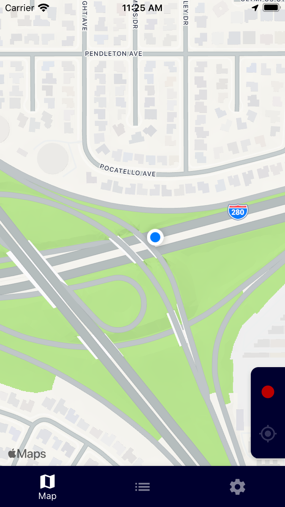
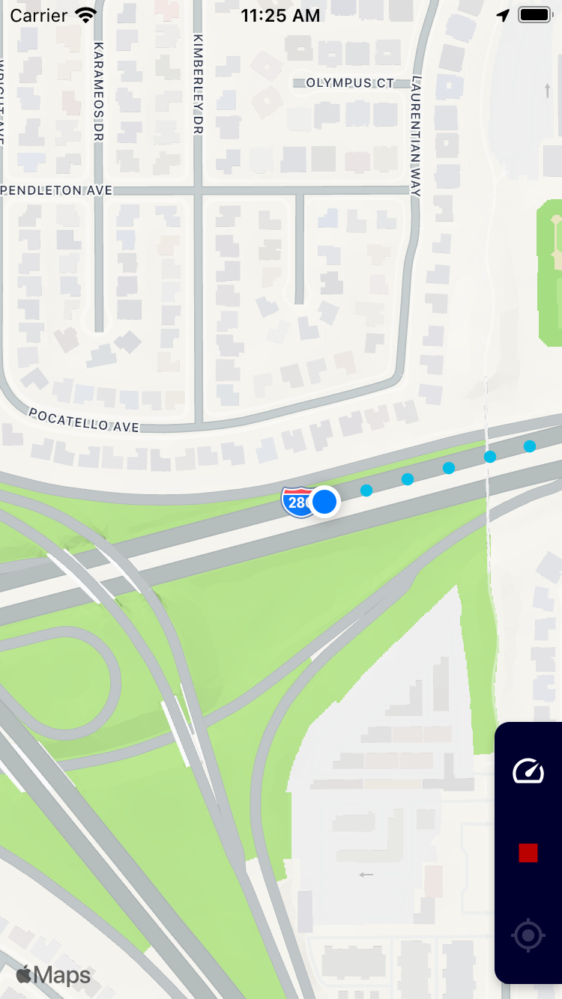
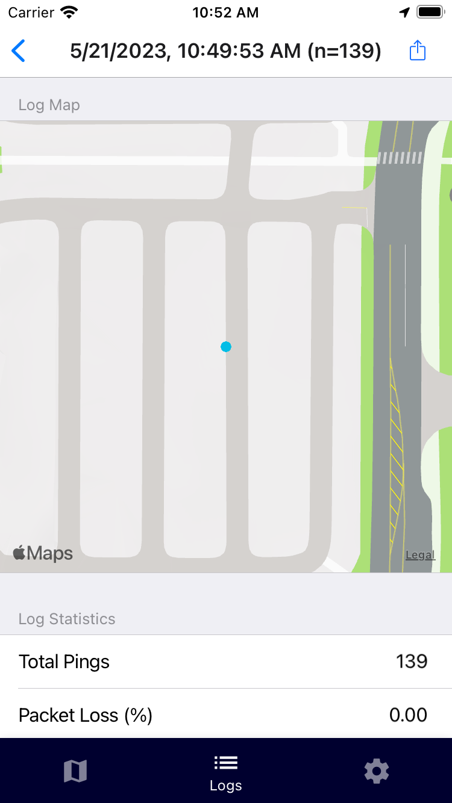
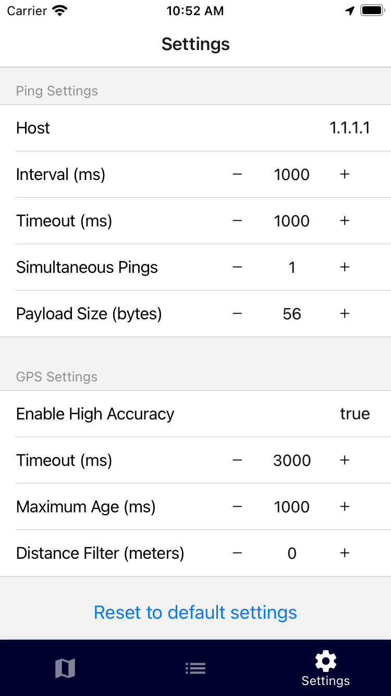

# Zetifi Ping

This is a simple Expo (currently only supports iOS but could support Android is there is interest) app that allows you to map network performance (either LTE or WiFi) and export the results to a CSV file.

<table>
  <tr>
    <td></td>
    <td></td>
    <td></td>
    <td></td>
  </tr>
</table>

## Installation

Clone the repo and run `yarn install` to install the dependencies.

## Usage

Run `yarn start` to start the expo server. You can then use the Expo app to run the app on your phone.

## License

All code for this project is licensed under the MIT license. See the LICENSE file for more details.

Assets including Zetifi logos and images are not licensed for reuse and remain the property of Agsensio Pty Ltd.

Dependencies are licensed under their respective licenses.
